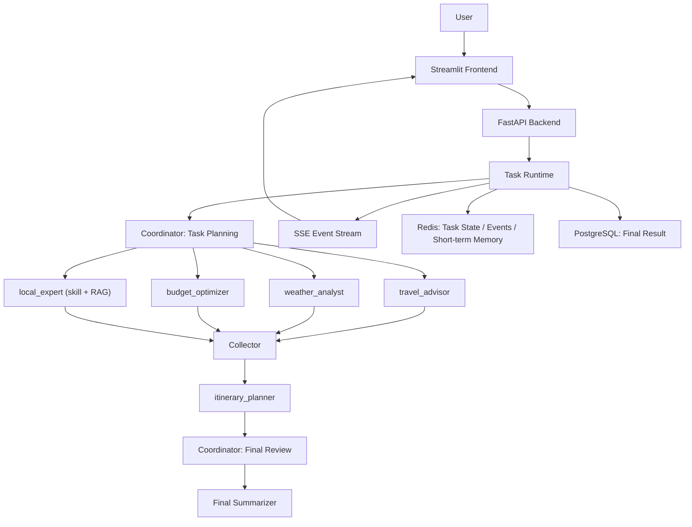

# Agent Travel

一个面向旅行规划场景的多 Agent 智能体项目，基于 FastAPI、Streamlit、LangGraph 和 OpenAI 兼容模型接口构建，支持并发分析、任务级流式输出、本地专家 skill/RAG、短期记忆、Redis 状态存储与 PostgreSQL 结果落库。

## 项目亮点

- 共享会话下的并发多 Agent 架构
- 分析型 Agent 并发执行，整合型 Agent 串行收敛
- 基于 SSE 的任务级流式输出
- 本地专家 `skill + RAG` 保留并参与最终规划
- 短期记忆可落 Redis，最终结果可落 PostgreSQL
- 支持 OpenAI 兼容模型、DuckDuckGo 搜索、MCP 天气工具

## 当前架构

`共享会话 + Agent 私有上下文 + 并发分析 + 串行整合 + 协调员终审`

核心流程如下：

1. 用户提交旅行请求
2. Coordinator 拆分子任务
3. `travel_advisor / weather_analyst / budget_optimizer / local_expert` 并发执行
4. Collector 汇总分析结果
5. `itinerary_planner` 生成逐日行程
6. Coordinator 做最终审阅与收口
7. Final summarizer 输出最终文档
8. 结果写入本地文件、Redis、PostgreSQL

## 架构图



## 核心模块

### 1. 多 Agent 规划引擎

后端核心位于 `backend/agents/langgraph_agents.py`，负责：

- 构建短期记忆
- 生成子任务
- 并发执行分析型 Agent
- 汇总结果
- 行程整合与协调员终审

### 2. API 与事件流

后端 API 位于 `backend/api_server.py`，负责：

- 接收规划请求
- 创建后台任务
- 输出任务状态
- 提供 SSE 流式事件接口
- 保存最终结果

### 3. 工具层

工具位于 `backend/tools/`，包括：

- DuckDuckGo 搜索工具
- MCP 天气客户端与天气服务
- 本地知识 RAG 工具
- 本地专家 skill

### 4. 存储层

存储逻辑位于 `backend/storage/persistence.py`，支持：

- Redis：任务元信息、事件流、短期记忆
- PostgreSQL：最终规划结果、Markdown、Agent 参与情况

## 短期记忆与流式输出

### 短期记忆

短期记忆是任务级状态，不做跨任务长期用户画像。当前短期记忆包含：

- `session_id`
- `shared_facts`
- `coordinator_plan`
- `collector_output`
- `itinerary_output`
- `coordinator_final_output`
- `agent_slots` 状态快照

### 流式输出

项目使用 SSE 实现任务级流式输出，事件包括：

- `task_created`
- `task_started`
- `coordinator_planned`
- `agent_started`
- `tool_called`
- `tool_completed`
- `agent_completed`
- `collector_completed`
- `itinerary_completed`
- `coordinator_finalized`
- `task_completed`

前端通过 `/stream/{task_id}` 实时消费这些事件，并在失败时回退到轮询模式。

## 技术栈

- Frontend: Streamlit
- Backend: FastAPI
- Workflow: LangGraph
- LLM: OpenAI-compatible API
- MCP: Weather MCP client/server
- RAG: Chroma-based local knowledge retrieval
- Cache / State: Redis
- Final Storage: PostgreSQL


## 环境建议

- Python 3.10+
- Anaconda 环境：`agent-travel`

### 常用环境变量

```bash
OPENAI_API_KEY=your_key
OPENAI_BASE_URL=your_openai_compatible_base_url
OPENAI_MODEL=your_model_name

REDIS_HOST=127.0.0.1
REDIS_PORT=6379
REDIS_DB=0

POSTGRES_HOST=127.0.0.1
POSTGRES_PORT=5432
POSTGRES_USER=postgres
POSTGRES_PASSWORD=your_password
POSTGRES_DB=postgres

QWEATHER_API_KEY=your_qweather_key
```

## 项目结构

```text
Agent-travel/
├─ backend/
│  ├─ agents/
│  ├─ tools/
│  ├─ storage/
│  ├─ skills/
│  ├─ config/
│  └─ api_server.py
├─ frontend/
│  └─ streamlit_app.py
├─ knowledge-rag/
```

## Acknowledgement
本项目的代码参考了开源工作：[FlyAIBox](https://github.com/FlyAIBox/Agent_In_Action/tree/main/03-agent-build-docker-deploy)

